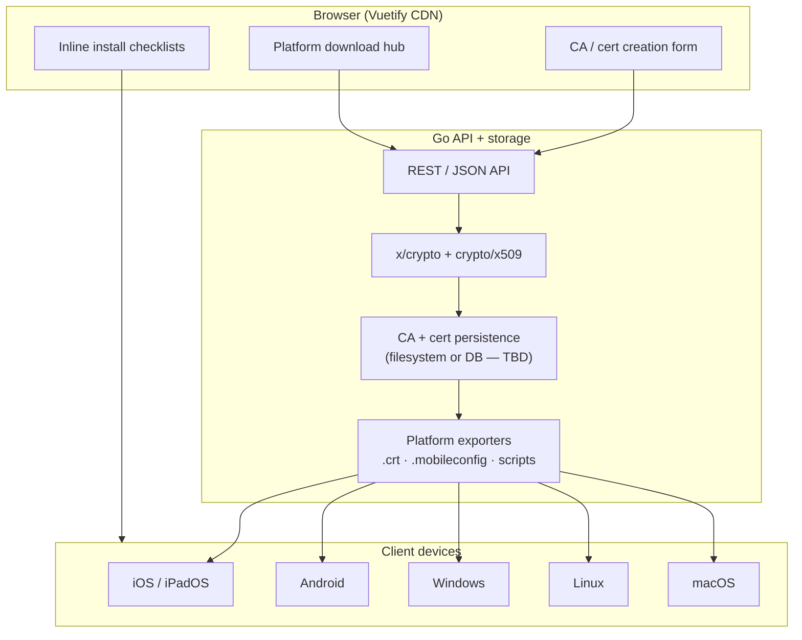

# self-ca

[](https://github.com/eSlider/self-ca/actions/workflows/test.yml)
[](https://pkg.go.dev/github.com/eSlider/self-ca)
[](https://opensource.org/licenses/MIT)
[](https://go.dev)

Self-hosted web service to **generate, store, and distribute** a private Certificate Authority (CA) and leaf certificates — with **platform-specific install guides** so iOS, Android, Windows, Linux, and macOS devices trust your HTTPS endpoints.

Inspired by [mkcert](https://github.com/FiloSottile/mkcert), but delivered as a **multi-user web UI** (Go backend + Vuetify frontend via CDN) instead of a local CLI-only tool.

## Status

| Phase | State |
|-------|-------|
| CLI prototype (ECDSA CA + HTTPS server) | ✅ Done — see `main.go` |
| Platform install documentation | ✅ Done — see [Platform guides](#platform-install-guides) |
| REST API (CA + leaf CRUD) | ✅ Done — see [API](#rest-api) |
| Config (`config.yml` + [go-config](https://github.com/eSlider/go-config)) | ✅ Done |
| Filesystem persistence + PEM downloads | ✅ Done |
| CI/CD (GitHub Actions) | ✅ Done — test, lint, security, release workflows |
| Web UI (Vuetify CDN) | 🔲 Planned |
| GitHub publish + pkg.go.dev | ✅ Published — `github.com/eSlider/self-ca` |

---

## The problem

Local and private-network HTTPS needs a trusted root CA on **every client device**. Each platform has different install steps, trust stores, and sharp edges:

- iOS requires a **second manual step** (Certificate Trust Settings)
- Android user CAs are **ignored by most apps** since Android 7
- Linux has **two incompatible** update tools (`update-ca-certificates` vs `update-ca-trust`)
- macOS requires setting **Always Trust** — import alone is not enough
- Firefox uses a **separate store** on every OS

self-ca aims to generate the crypto material once, then ship the right artifact and instructions per platform.

---

## Architecture (planned)



### Stack

| Layer | Choice | Notes |
|-------|--------|-------|
| Backend | Go 1.24+ | Reuse existing `crypto/x509` generation in `main.go` |
| Frontend | Vue 3 + Vuetify 3 via CDN | No build step; static assets served by Go or separate CDN |
| TLS | Self-signed bootstrap | **TASK:** first-run generates admin CA; see [SEC-1](#open-issues--task-tracker) |
| Storage | TBD | Filesystem (PEM tree) vs SQLite — see [ARCH-1](#open-issues--task-tracker) |

---

## Platform install guides

Each guide documents the **correct trust method**, verification steps, and **known platform limitations** (nothing hidden).

| Platform | Guide | Critical gotcha |
|----------|-------|-----------------|
| iOS / iPadOS | [docs/ios/README.md](docs/ios/README.md) | Must enable **Certificate Trust Settings** after install |
| Android | [docs/android/README.md](docs/android/README.md) | User CA ≠ system CA — most apps won't trust it |
| Windows | [docs/windows/README.md](docs/windows/README.md) | Must import into **Trusted Root**, not Personal |
| Linux | [docs/linux/README.md](docs/linux/README.md) | Debian vs RHEL vs Arch use different commands |
| macOS | [docs/mac/README.md](docs/mac/README.md) | Must set **Always Trust** for SSL in Keychain |

---

## Roadmap

### Phase 1 — Documentation (current)

- [x] Per-platform install workflows in `docs/{platform}/README.md`
- [x] Known issues documented as explicit TASK tables in each guide
- [ ] Review docs on real devices (iPhone, Pixel, Win11, Ubuntu, macOS)

### Phase 2 — Web service core

- [x] Extract cert generation from `main.go` into `internal/ca` package
- [x] REST API: create CA, issue leaf cert (CN, SANs, validity)
- [x] In-memory store + CRUD integration tests
- [x] Persist CA + issued certs to disk (`data/cas/`)
- [x] Download endpoints: PEM bundles (`ca.pem`, `cert.pem`, `key.pem`, `chain.pem`)
- [x] Configuration via `config.yml` ([go-config](https://github.com/eSlider/go-config))

### Phase 3 — Frontend (Vuetify CDN)

- [ ] Single-page UI: CA wizard, cert list, expiry display
- [ ] Platform picker → download + copy-paste commands
- [ ] QR codes for mobile download URLs

### Phase 4 — Platform exporters

- [ ] iOS/macOS `.mobileconfig` generator (`com.apple.security.root`)
- [ ] Windows `install-ca.ps1` / `install-ca.bat`
- [ ] Linux auto-detect script (`/etc/os-release` → debian|rhel|arch)
- [ ] Android `network_security_config.xml` snippet for app developers

### Phase 5 — GitHub release

- [x] GitHub Actions CI (test, lint, security, release on tags)
- [x] Publish repo, first `v0.1.0` tag
- [ ] Go module indexed on pkg.go.dev (after tag propagates)
- [ ] Docker image (optional)

---

## GitHub & Go module publishing

Follow the pattern used by [eSlider/go-onlyoffice](https://github.com/eSlider/go-onlyoffice):

### Module path

```
module github.com/eSlider/self-ca
```

Install:

```bash
go get github.com/eSlider/self-ca
```

### Repository setup

```bash
gh repo create eSlider/self-ca --public \
  --description "Self-hosted CA web service — generate, store, and install private HTTPS certificates on iOS, Android, Windows, Linux, and macOS" \
  --source=. --remote=origin --push
```

### Module path migration (done)

~~`produktor.io/self-ca`~~ → `github.com/eSlider/self-ca`

### README badges (after publish)

- Go Reference badge → `pkg.go.dev/github.com/eSlider/self-ca`
- License MIT
- Go version
- Latest release tag

### CI (planned)

- `go test ./...`
- `golangci-lint` (optional)
- Release workflow with GoReleaser (binaries + checksums)

### Library vs application

| Mode | Import path | Use case |
|------|-------------|----------|
| CLI / server | `github.com/eSlider/self-ca/cmd/self-ca` | Run the web service |
| Library | `github.com/eSlider/self-ca/ca` | Programmatic cert generation in other Go projects |

---

## Configuration

Settings live in [`config.yml`](config.yml), loaded via [go-config](https://github.com/eSlider/go-config). Environment variables override YAML (e.g. `SERVER_APIADDR=:3000`, `DATA_DIR=./my-data`).

```bash
# Generate certs using setup.* from config.yml
go run . -config config.yml -setup

# Start with config defaults
go run . -config config.yml
```

## REST API

HTTP JSON API (filesystem store under `data/cas/`). Start with:

```bash
go run . -config config.yml
```

| Method | Path | Description |
|--------|------|-------------|
| `POST` | `/api/cas` | Create CA |
| `GET` | `/api/cas` | List CAs |
| `GET` | `/api/cas/{id}` | Get CA (cert only, no private key) |
| `PUT` | `/api/cas/{id}` | Update CA metadata |
| `DELETE` | `/api/cas/{id}` | Delete CA and leaf certs |
| `POST` | `/api/cas/{caId}/certs` | Issue leaf certificate |
| `GET` | `/api/cas/{caId}/certs` | List leaf certs |
| `GET` | `/api/cas/{caId}/certs/{id}` | Get leaf cert + key |
| `PUT` | `/api/cas/{caId}/certs/{id}` | Re-issue leaf cert (new PEM) |
| `DELETE` | `/api/cas/{caId}/certs/{id}` | Delete leaf cert |
| `GET` | `/api/cas/{id}/download/{file}` | Download CA PEM (`ca.pem`, `ca.crt`) |
| `GET` | `/api/cas/{caId}/certs/{id}/download/{file}` | Download `cert.pem`, `key.pem`, or `chain.pem` |

Example:

```bash
# Create CA
curl -s localhost:8080/api/cas -d '{"common_name":"My Dev CA"}' | jq .

# Issue leaf cert
CA_ID=<id-from-above>
curl -s localhost:8080/api/cas/$CA_ID/certs \
  -d '{"common_name":"localhost","dns_names":["localhost"],"ip_addresses":["127.0.0.1"]}' | jq .
```

## Quick start (CLI prototype)

```bash
# Generate CA + localhost server cert from config.yml
go run . -config config.yml -setup

# Start HTTPS + API (ports from config.yml)
go run . -config config.yml

# Disable API: go run . -api ""
# Override API port: go run . -api :9090

# Run tests (CI runs the same with -race)
go test ./... -race
```

Generated files: `ca.crt`, `server.crt`, `server.key`.

> **Warning:** sample certs in the repo root are for development only. Do not commit production private keys — add `*.key` to `.gitignore` (**SEC-3**).

---

## Open issues & task tracker

Project-level issues are tracked here and cross-referenced in platform docs.

| ID | Issue | Severity | Task |
|----|-------|----------|------|
| **MOD-1** | ~~Module path~~ | Done | `github.com/eSlider/self-ca` |
| **SEC-1** | Bootstrap chicken-and-egg: UI served over HTTPS needs a cert | High | First-run wizard or HTTP-only LAN mode with explicit warning |
| **SEC-2** | CA private key storage undefined | High | Encrypt at rest (age/OS keystore); never expose via API |
| **SEC-3** | `server.key` / `ca.key` may be committed accidentally | High | Add `.gitignore`; git-secrets in CI |
| **ARCH-1** | No multi-tenant / multi-CA design yet | Medium | Schema: one CA per "project" or per user |
| **ARCH-2** | No cert revocation (CRL/OCSP) | Medium | Document limitation; optional CRL in v2 |
| **UX-1** | Platform install is manual — service can't remote-install | Expected | Honest UX: guided downloads, not silent trust |
| **UX-2** | Android system trust requires MDM/root | Expected | Don't over-promise in marketing copy |
| **DEV-1** | Frontend CDN pinned versions not chosen | Low | Pin Vue/Vuetify SRI hashes in `index.html` |
| **DEV-2** | ~~No LICENSE file~~ | Done | MIT LICENSE added |

Platform-specific issues: see TASK tables in each [platform guide](#platform-install-guides).

---

## Related projects

- [mkcert](https://github.com/FiloSottile/mkcert) — local dev CA with automatic OS trust (CLI)
- [step-ca](https://github.com/smallstep/certificates) — production ACME CA
- [go-onlyoffice](https://github.com/eSlider/go-onlyoffice) — reference for Go library publishing on GitHub

---

## License

MIT — see [LICENSE](LICENSE)
