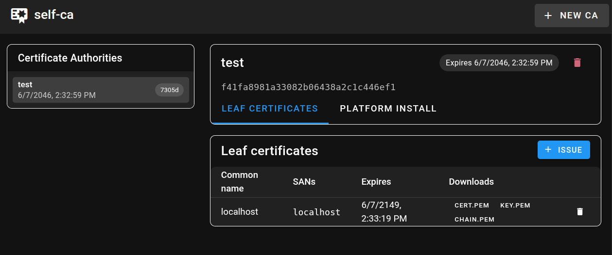
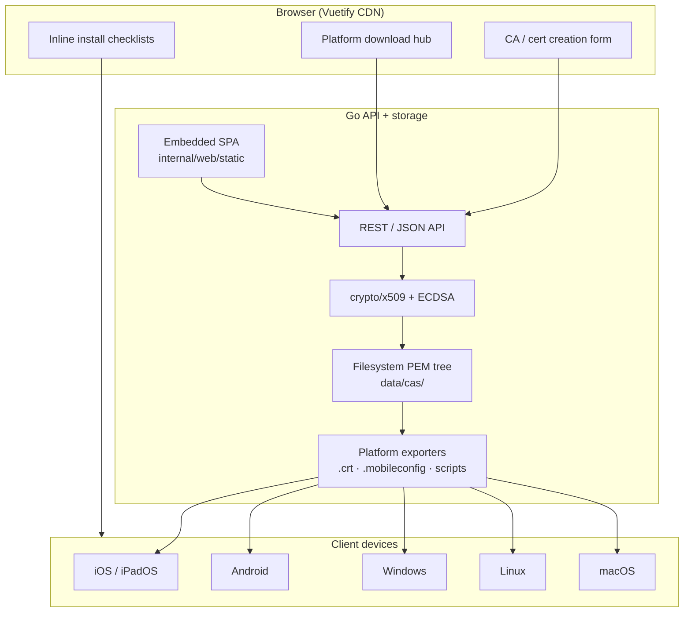

# self-ca

Self-hosted web service to **generate, store, and distribute** a private Certificate Authority (CA) and leaf certificates — with **platform-specific install guides** so iOS, Android, Windows, Linux, and macOS devices trust your HTTPS endpoints.

Inspired by [mkcert](https://github.com/FiloSottile/mkcert), but delivered as a **multi-user web UI** (Go backend + Vuetify frontend via CDN) instead of a local CLI-only tool.

---

## The problem

Local and private-network HTTPS needs a trusted root CA on **every client device**. Each platform has different install steps, trust stores, and sharp edges:

- iOS requires a **second manual step** (Certificate Trust Settings)
- Android user CAs are **ignored by most apps** since Android 7
- Linux has **two incompatible** update tools (`update-ca-certificates` vs `update-ca-trust`)
- macOS requires setting **Always Trust** — import alone is not enough
- Firefox uses a **separate store** on every OS

self-ca generates the crypto material once, then ships the right artifact and instructions per platform.

---

## Quick start

```bash
# Generate CA + localhost server cert from config.yml
go run . -config config.yml -setup

# Start UI + API (default :8080; override port with -api)
go run . -config config.yml
go run . -config config.yml -api :8081 -tls ""

# Run tests (CI runs the same with -race)
go test ./... -race
```



Open the web UI at **http://localhost:8080** (or your `-api` port). API and SPA share the same listener.

Generated files (local `-setup`): `ca.crt`, `server.crt`, `server.key`.

> **Warning:** sample certs in the repo root are for development only. Do not commit production private keys — see **SEC-3** in [Open issues](#open-issues--task-tracker).

---

## Platform install guides

Each guide documents the **correct trust method**, verification steps, and **known platform limitations** (nothing hidden).

Use [docs/DEVICE_REVIEW.md](docs/DEVICE_REVIEW.md) when validating guides on real hardware.

| Platform     | Guide                                            | Critical gotcha                                          |
| ------------ | ------------------------------------------------ | -------------------------------------------------------- |
| iOS / iPadOS | [docs/ios/README.md](docs/ios/README.md)         | Must enable **Certificate Trust Settings** after install |
| Android      | [docs/android/README.md](docs/android/README.md) | User CA ≠ system CA — most apps won't trust it           |
| Windows      | [docs/windows/README.md](docs/windows/README.md) | Must import into **Trusted Root**, not Personal          |
| Linux        | [docs/linux/README.md](docs/linux/README.md)     | Debian vs RHEL vs Arch use different commands            |
| macOS        | [docs/mac/README.md](docs/mac/README.md)         | Must set **Always Trust** for SSL in Keychain            |

---

## REST API

HTTP JSON API (filesystem store under `data/cas/`).

| Method   | Path                                         | Description                                    |
| -------- | -------------------------------------------- | ---------------------------------------------- |
| `POST`   | `/api/cas`                                   | Create CA                                      |
| `GET`    | `/api/cas`                                   | List CAs                                       |
| `GET`    | `/api/cas/{id}`                              | Get CA (cert only, no private key)             |
| `PUT`    | `/api/cas/{id}`                              | Update CA metadata                             |
| `DELETE` | `/api/cas/{id}`                              | Delete CA and leaf certs                       |
| `POST`   | `/api/cas/{caId}/certs`                      | Issue leaf certificate                         |
| `GET`    | `/api/cas/{caId}/certs`                      | List leaf certs                                |
| `GET`    | `/api/cas/{caId}/certs/{id}`                 | Get leaf cert + key                            |
| `PUT`    | `/api/cas/{caId}/certs/{id}`                 | Re-issue leaf cert (new PEM)                   |
| `DELETE` | `/api/cas/{caId}/certs/{id}`                 | Delete leaf cert                               |
| `GET`    | `/api/cas/{id}/download/{file}`              | Download CA PEM (`ca.pem`, `ca.crt`)           |
| `GET`    | `/api/cas/{caId}/certs/{id}/download/{file}` | Download `cert.pem`, `key.pem`, or `chain.pem` |

### Export endpoints

| Method | Path                                | Description                                   |
| ------ | ----------------------------------- | --------------------------------------------- |
| `GET`  | `/api/cas/{id}/export/mobileconfig` | Apple `.mobileconfig` (iOS / macOS)           |
| `GET`  | `/api/cas/{id}/export/windows-ps1`  | PowerShell install script (Current User)      |
| `GET`  | `/api/cas/{id}/export/windows-bat`  | Batch install script (admin / LocalMachine)   |
| `GET`  | `/api/cas/{id}/export/linux`        | Linux install script (auto-detect distro)     |
| `GET`  | `/api/cas/{id}/export/android`      | Android `network_security_config.xml` snippet |

Example:

```bash
# Create CA
curl -s localhost:8080/api/cas -d '{"common_name":"My Dev CA"}' | jq .

# Issue leaf cert
CA_ID=<id-from-above>
curl -s localhost:8080/api/cas/$CA_ID/certs \
  -d '{"common_name":"localhost","dns_names":["localhost"],"ip_addresses":["127.0.0.1"]}' | jq .
```

---

## Configuration

Settings live in [`config.yml`](config.yml), loaded via [go-config](https://github.com/eSlider/go-config). Environment variables override YAML (e.g. `SERVER_APIADDR=:3000`, `DATA_DIR=./my-data`).

```bash
go run . -config config.yml -setup   # generate bootstrap TLS material
go run . -config config.yml          # start with config defaults
go run . -api :8081 -tls ""          # HTTP-only on custom port
```

When TLS certs exist (`server.crt`, `server.key`), HTTPS is served on `:8443` by default alongside HTTP.

---

## Docker

```bash
docker build -t self-ca .
docker run --rm -p 8080:8080 -v self-ca-data:/data \
  self-ca -api :8080 -tls ""
```

Generate bootstrap TLS certs inside the container or mount `server.crt` / `server.key` for HTTPS on `:8443`.

---

## Architecture



### Stack

| Layer    | Choice                    | Notes                                                                           |
| -------- | ------------------------- | ------------------------------------------------------------------------------- |
| Backend  | Go 1.25+                  | `internal/ca`, REST API, filesystem store                                       |
| Frontend | Vue 3 + Vuetify 3 via CDN | Embedded SPA at `/` — no build step                                             |
| TLS      | Bootstrap server cert     | HTTP-only fallback when certs missing — see [SEC-1](#open-issues--task-tracker) |
| Storage  | Filesystem                | PEM tree under `data/cas/{ca-id}/`                                              |

---

## Open issues & task tracker

Project-level issues are tracked here and cross-referenced in platform docs.

| ID         | Issue                                                        | Severity | Task                                                                    |
| ---------- | ------------------------------------------------------------ | -------- | ----------------------------------------------------------------------- |
| **MOD-1**  | ~~Module path~~                                              | Done     | `github.com/eSlider/self-ca`                                            |
| **SEC-1**  | Bootstrap chicken-and-egg: UI served over HTTPS needs a cert | High     | HTTP-only mode when TLS certs missing; run `-setup` for HTTPS           |
| **SEC-2**  | CA private key storage undefined                             | High     | Encrypt at rest (age/OS keystore); never expose via API                 |
| **SEC-3**  | `server.key` / `ca.key` may be committed accidentally        | High     | Add `.gitignore`; git-secrets in CI                                     |
| **ARCH-1** | Single CA per filesystem tree                                | Medium   | Multi-tenant / per-user CAs in v2                                       |
| **ARCH-2** | No cert revocation (CRL/OCSP)                                | Medium   | Document limitation; optional CRL in v2                                 |
| **UX-1**   | Platform install is manual — service can't remote-install    | Expected | Honest UX: guided downloads, not silent trust                           |
| **UX-2**   | Android system trust requires MDM/root                       | Expected | Don't over-promise in marketing copy                                    |
| **DEV-1**  | Frontend CDN pinned versions not chosen                      | Low      | Vue 3.5.13 + Vuetify 3.7.4 pinned via jsDelivr (SRI optional follow-up) |
| **DEV-2**  | ~~No LICENSE file~~                                          | Done     | MIT LICENSE added                                                       |

Platform-specific issues: see TASK tables in each [platform guide](#platform-install-guides).

---

## Roadmap

### Phase 1 — Documentation

- [x] Per-platform install workflows in `docs/{platform}/README.md`
- [x] Known issues documented as explicit TASK tables in each guide
- [x] Device validation checklist — [docs/DEVICE_REVIEW.md](docs/DEVICE_REVIEW.md)

### Phase 2 — Web service core

- [x] Extract cert generation from `main.go` into `internal/ca` package
- [x] REST API: create CA, issue leaf cert (CN, SANs, validity)
- [x] In-memory store + CRUD integration tests
- [x] Persist CA + issued certs to disk (`data/cas/`)
- [x] Download endpoints: PEM bundles (`ca.pem`, `cert.pem`, `key.pem`, `chain.pem`)
- [x] Configuration via `config.yml` ([go-config](https://github.com/eSlider/go-config))

### Phase 3 — Frontend (Vuetify CDN)

- [x] Single-page UI: CA wizard, cert list, expiry display
- [x] Platform picker → download + copy-paste URLs
- [x] QR codes for mobile download URLs

### Phase 4 — Platform exporters

- [x] iOS/macOS `.mobileconfig` generator (`com.apple.security.root`)
- [x] Windows `install-ca.ps1` / `install-ca.bat`
- [x] Linux auto-detect script (`/etc/os-release` → debian|rhel|arch)
- [x] Android `network_security_config.xml` snippet for app developers

### Phase 5 — GitHub release

- [x] GitHub Actions CI (test, lint, security, release on tags)
- [x] Publish repo, `v0.1.0` and `v0.2.0` tags
- [x] Go module on pkg.go.dev — [pkg.go.dev/github.com/eSlider/self-ca](https://pkg.go.dev/github.com/eSlider/self-ca)
- [x] Docker image — see [Docker](#docker)

---

## Status

| Phase                                                                     | State                                                                 |
| ------------------------------------------------------------------------- | --------------------------------------------------------------------- |
| CLI prototype (ECDSA CA + HTTPS server)                                   | ✅ Done — see `main.go`                                                |
| Platform install documentation                                            | ✅ Done — see [Platform guides](#platform-install-guides)              |
| REST API (CA + leaf CRUD)                                                 | ✅ Done — see [REST API](#rest-api)                                    |
| Config (`config.yml` + [go-config](https://github.com/eSlider/go-config)) | ✅ Done                                                                |
| Filesystem persistence + PEM downloads                                    | ✅ Done                                                                |
| CI/CD (GitHub Actions)                                                    | ✅ Done — test, lint, security, release workflows                      |
| Web UI (Vuetify CDN)                                                      | ✅ Done — embedded SPA at `/`                                          |
| Platform exporters                                                        | ✅ Done — see [Export endpoints](#export-endpoints)                    |
| Docker image                                                              | ✅ Done — see [Docker](#docker)                                        |
| GitHub publish + pkg.go.dev                                               | ✅ Published — [`v0.2.0`](https://github.com/eSlider/self-ca/releases) |

[](https://github.com/eSlider/self-ca/actions/workflows/test.yml)
[](https://pkg.go.dev/github.com/eSlider/self-ca)
[](https://opensource.org/licenses/MIT)
[](https://go.dev)

---

## GitHub & Go module

```
module github.com/eSlider/self-ca
```

```bash
go get github.com/eSlider/self-ca
go install github.com/eSlider/self-ca@v0.2.0
```

| Mode         | Import path                              | Use case                           |
| ------------ | ---------------------------------------- | ---------------------------------- |
| CLI / server | `github.com/eSlider/self-ca`             | Run the web service (`go run .`)   |
| Library      | `github.com/eSlider/self-ca/internal/ca` | Programmatic cert generation in Go |

Repository: [github.com/eSlider/self-ca](https://github.com/eSlider/self-ca)

---

## Related projects

- [mkcert](https://github.com/FiloSottile/mkcert) — local dev CA with automatic OS trust (CLI)
- [step-ca](https://github.com/smallstep/certificates) — production ACME CA
- [go-onlyoffice](https://github.com/eSlider/go-onlyoffice) — reference for Go library publishing on GitHub

---

## License

MIT — see [LICENSE](LICENSE)
